##Dashboard Queries

---
###1. Total discount by category

###2. Total bill amount by customer id
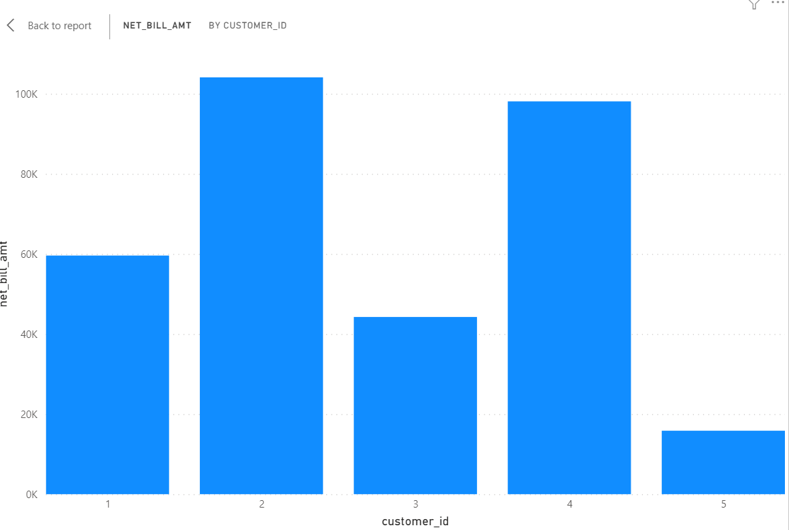

###3.Total bill amount by brand
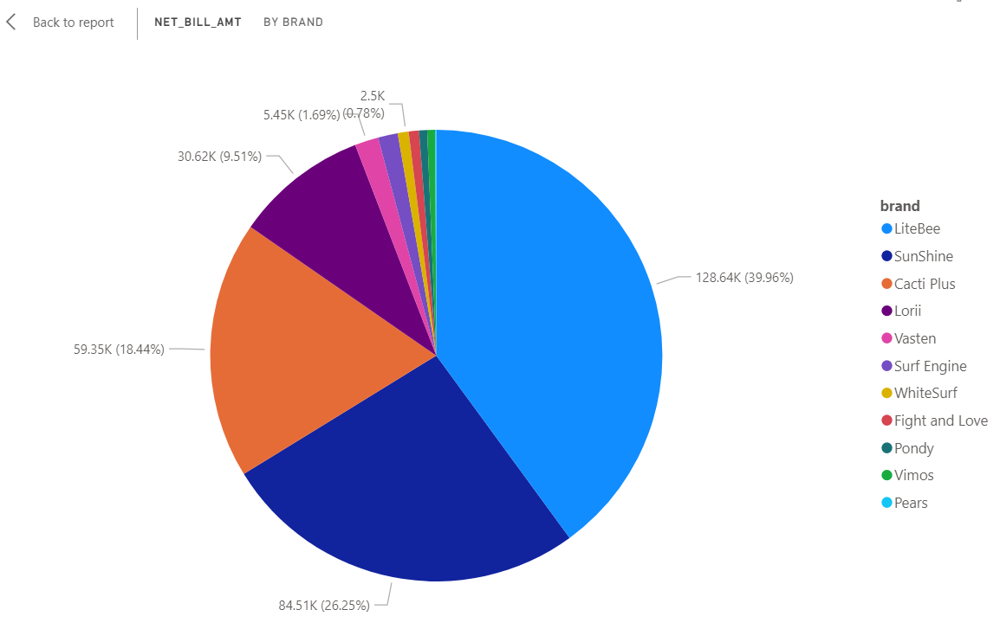

###4. Total bill amount by location

###5. Total bill amount by date
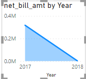

###6.Total bill amount by Customer_id
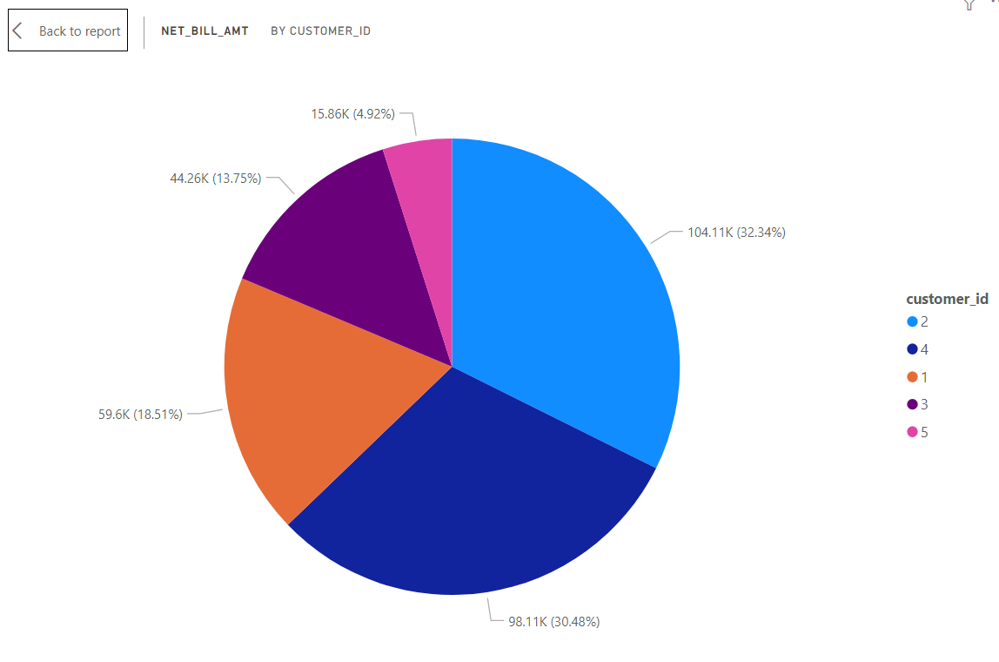

###7. Relation between qty and net bill amount
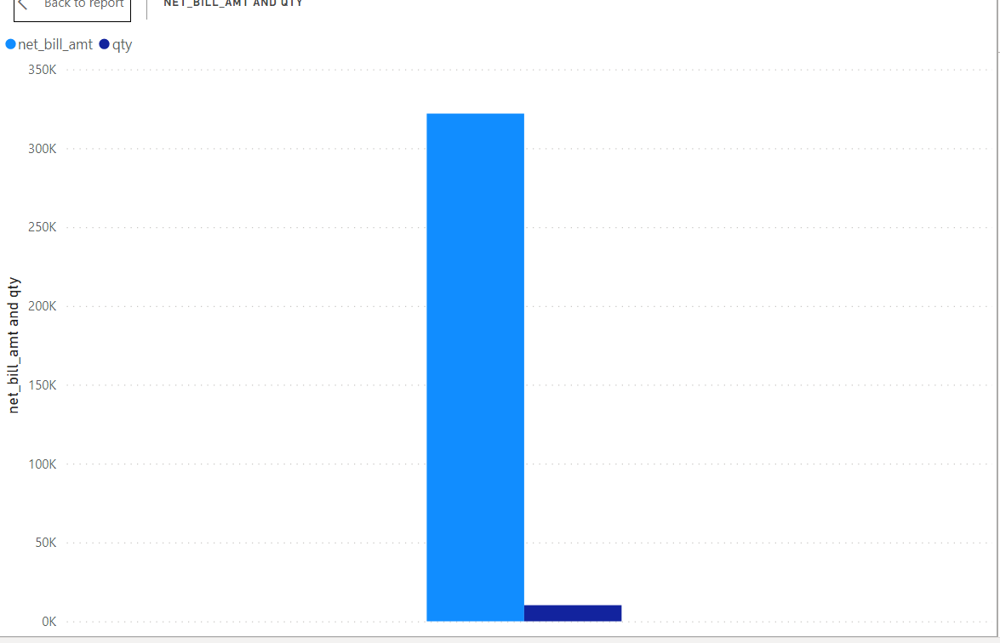

###8. Relation between qty and discount
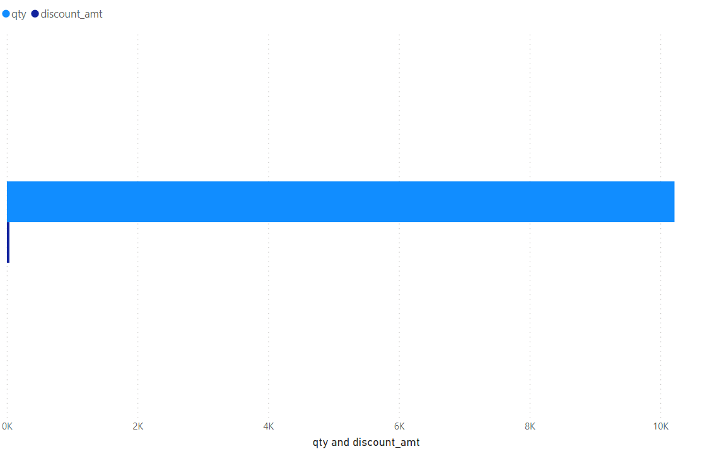

###9. Detail tables for all details(customerid,discount,bill amount)
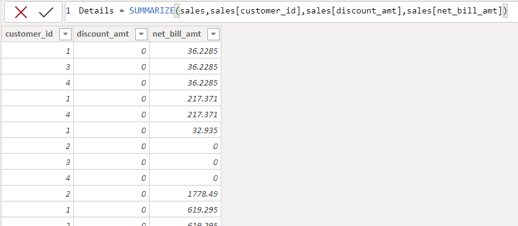

###10. KPIS
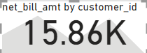

###11. Sales trend
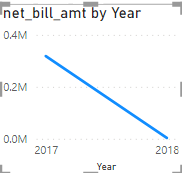

###12. Uses of measures, DAX,calculated columns
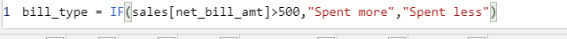
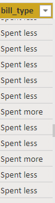

###13. Top 2 Billed customer 
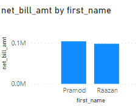

###14. Top 2 Billed category 
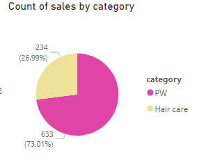