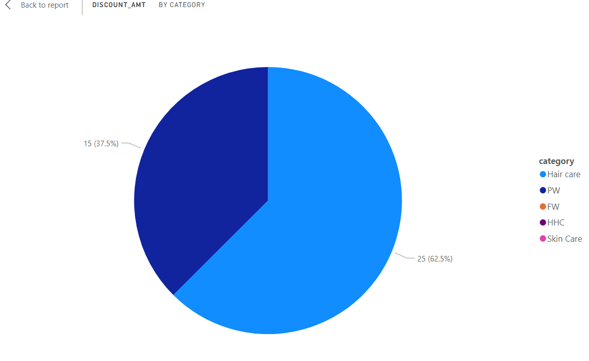
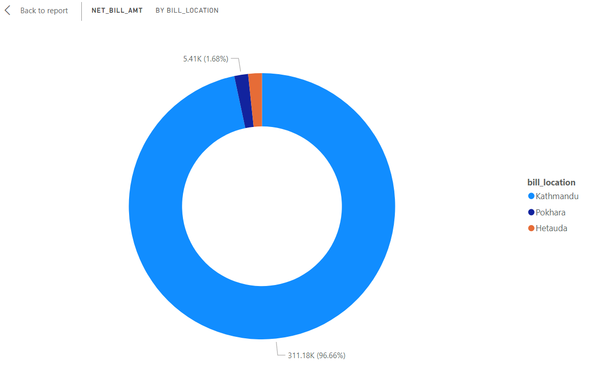

##Dashboard Queries

---
###1. Total discount by category

###2. Total bill amount by customer id

###3.Total bill amount by brand

###4. Total bill amount by location

###5. Total bill amount by date

###6.Total bill amount by Customer_id

###7. Relation between qty and net bill amount

###8. Relation between qty and discount

###9. Detail tables for all details(customerid,discount,bill amount)

###10. KPIS

###11. Sales trend

###12. Uses of measures, DAX,calculated columns

###13. Top 2 Billed customer 

###14. Top 2 Billed category 
